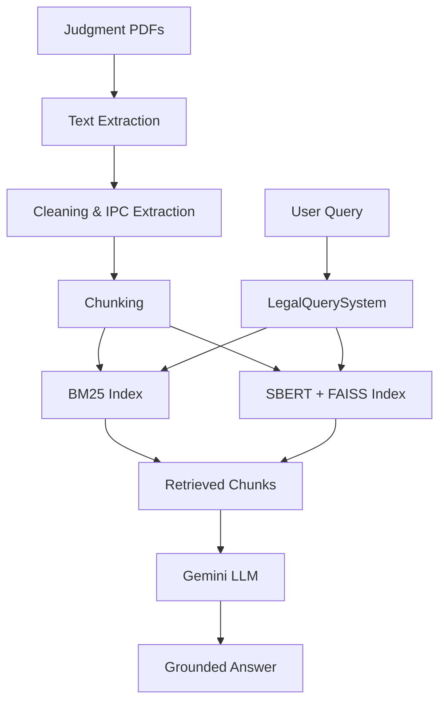

---

## RAG-Based System for Legal Precedent Retrieval and Summarization

A RAG system for retrieving relevant Indian Supreme Court criminal-law
precedents and generating grounded answers using retrieved judgment passages.

---

## Problem Statement

Searching decades of Supreme Court judgments for relevant precedents is
time-consuming.

The system addresses this using:

- BM25 lexical retrieval
- SBERT + FAISS semantic retrieval
- Gemini-based grounded generation

---

## Key Features

- PDF judgment text extraction
- IPC section extraction
- Sentence-based chunking
- BM25 retrieval
- SBERT + FAISS retrieval
- Gemini answer generation
- Streamlit interface
- Retrieval evaluation

---

## System Architecture

## Results

| Metric | BM25 | SBERT + FAISS |
|---|---:|---:|
| Hit Rate@1 | 70% | 55% |
| Hit Rate@5 | 83% | 71% |
| MRR | 0.748 | 0.611 |
| Avg. Latency | 0.090s | 0.011s |

Corpus:

- **3,210** criminal cases
- **127,645** chunks
- Average chunk size: **226.5 words**

---

## Tech Stack

- Python
- spaCy
- BM25
- Sentence-BERT
- FAISS
- Google Gemini
- Streamlit
- Git

---

## My Contributions

- Implemented document preprocessing and chunking
- Built BM25 and SBERT + FAISS retrieval
- Integrated Gemini RAG generation
- Developed evaluation and latency benchmarking
- Built the Streamlit interface

---

## Note

The system was developed as a research project for Indian criminal-law
precedent retrieval. BM25 and semantic retrieval were evaluated independently
using an IPC-section-based relevance protocol.
